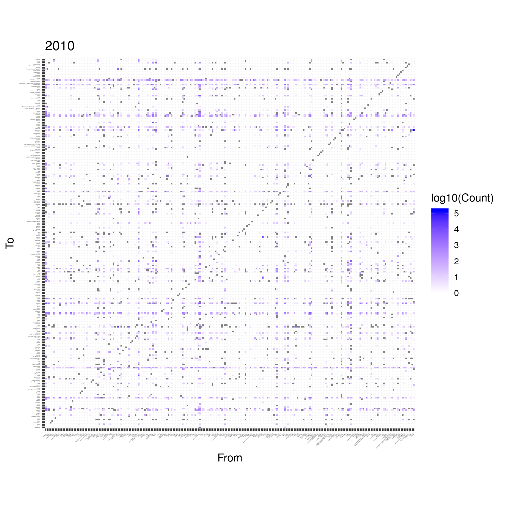
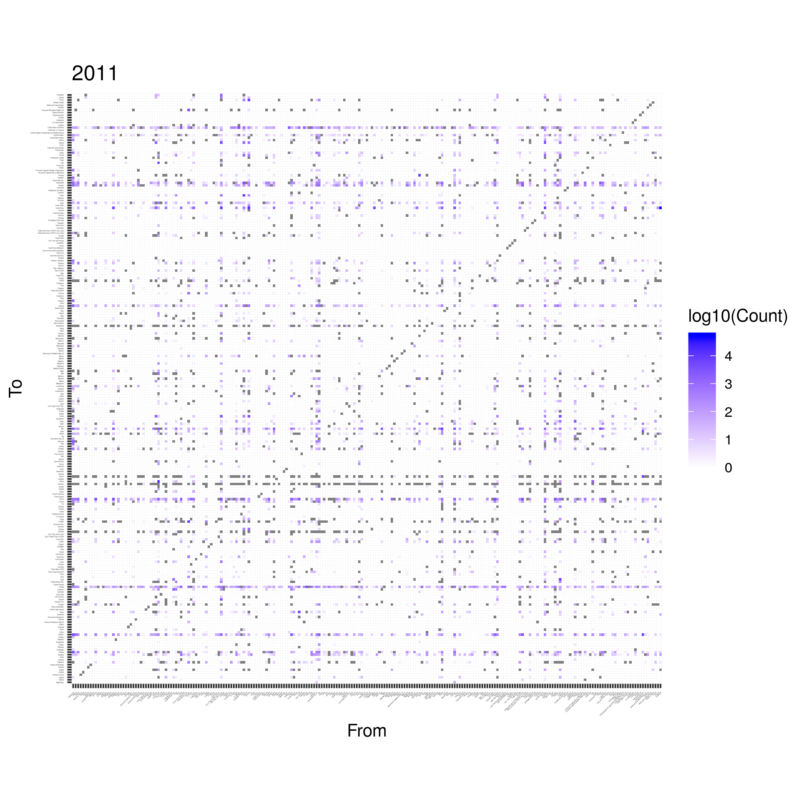
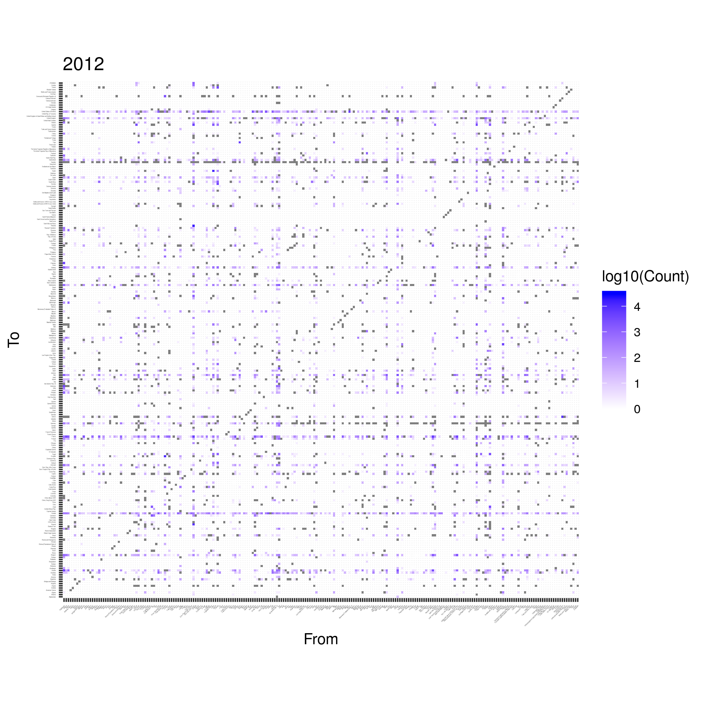
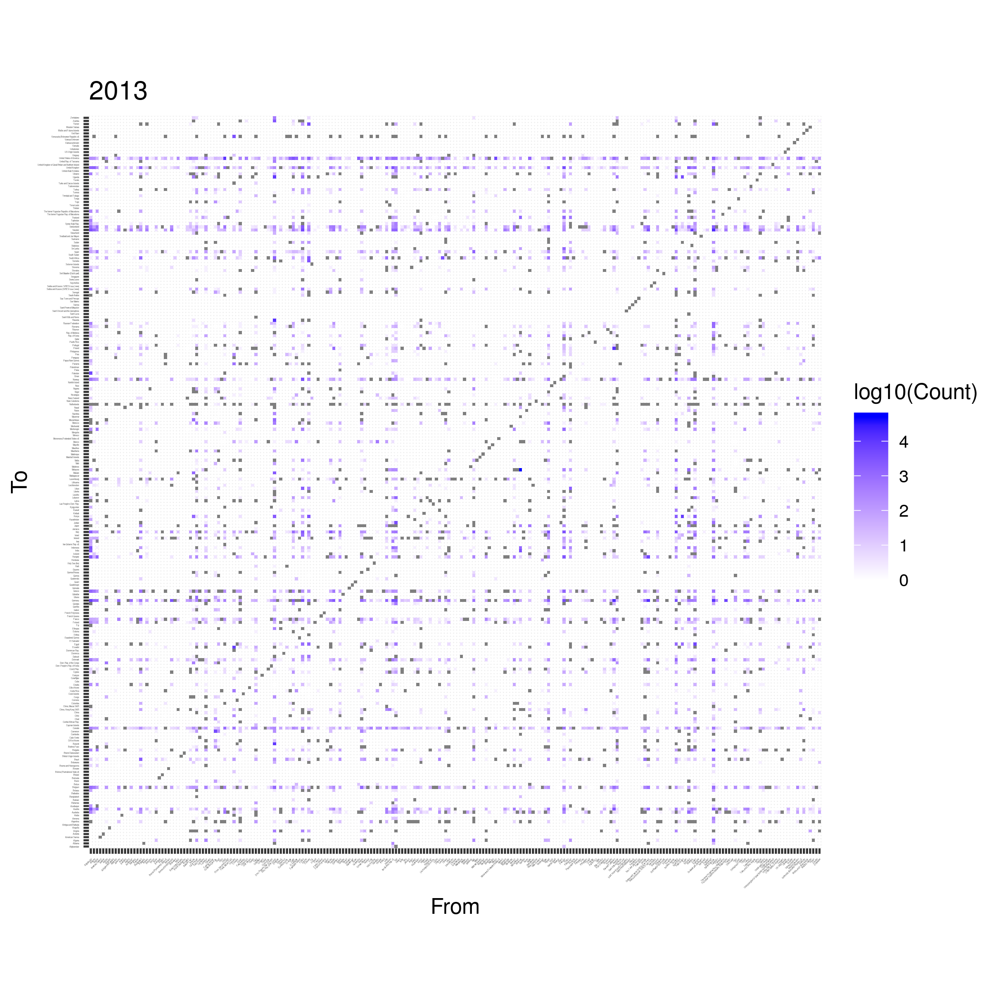
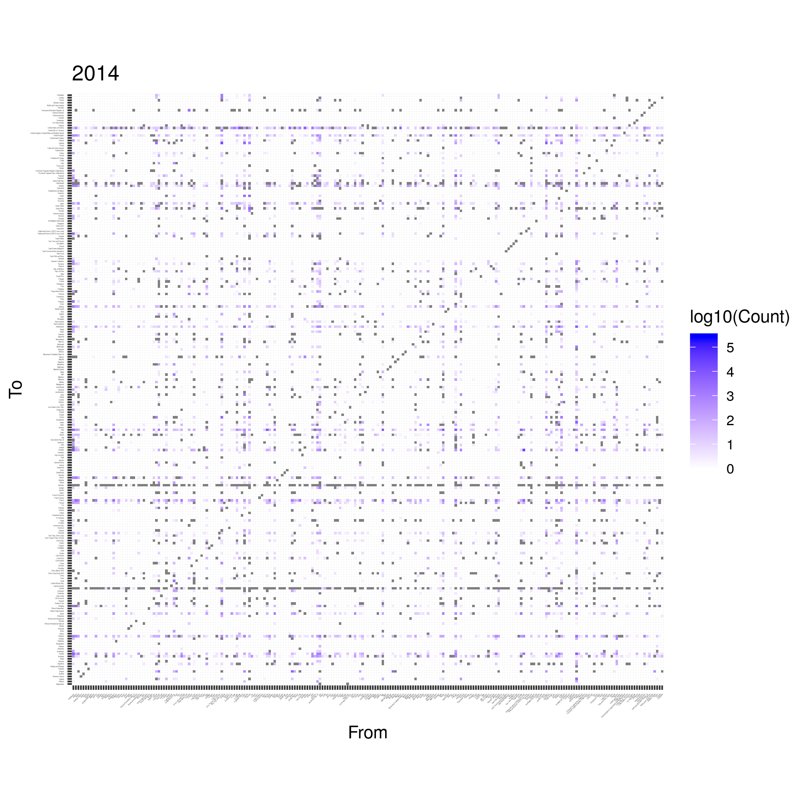
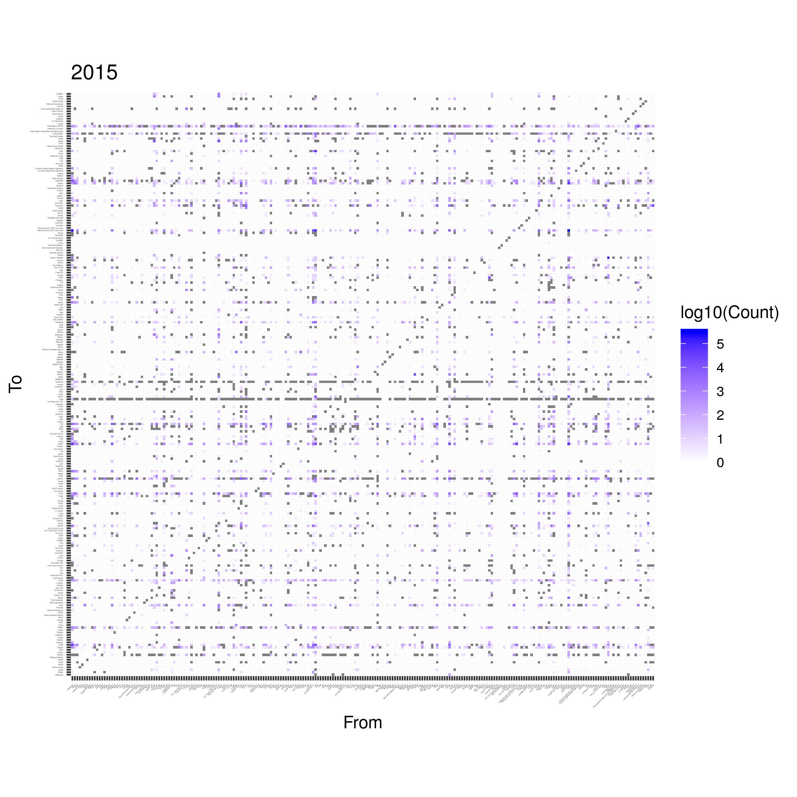
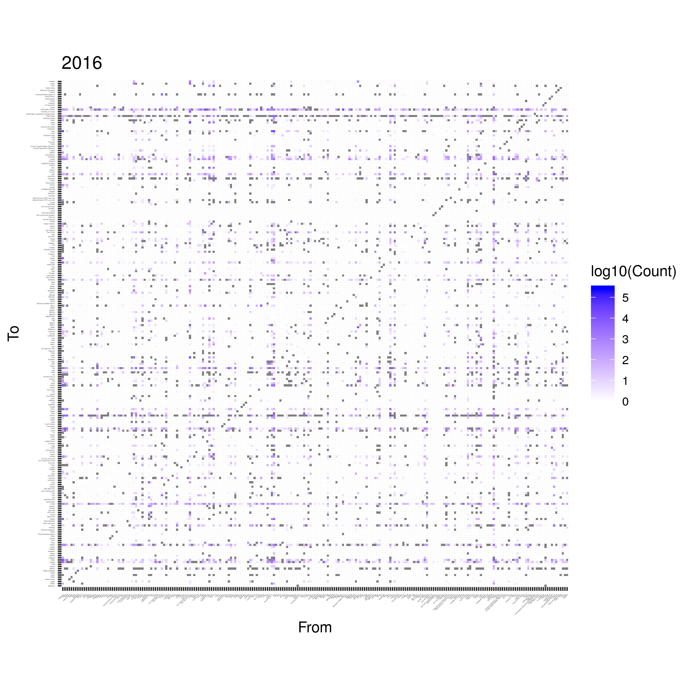
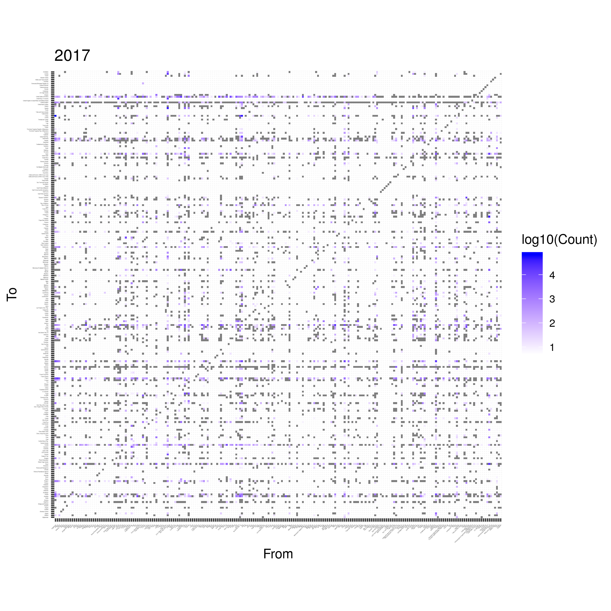

```{r,echo=FALSE,warning=FALSE,include=FALSE}
paquetines <- c("stringi","reshape2","plyr","dplyr","tidyr","sets","plotly","readr","igraph","maps","geosphere",
                "ggplot2","lubridate","e1071","useful","magrittr","gower","cluster","RNeo4j","data.table",
                "factoextra","NbClust","readr","DescTools","gridExtra","egg","rworldmap","rgeos")
no_instalados <- paquetines[!(paquetines %in% installed.packages()[,"Package"])]
if(length(no_instalados)) install.packages(no_instalados)
lapply(paquetines, library, character.only = TRUE)
```


```{r}
graph = startGraph('http://localhost:7474/db/data/')

query <- '
MATCH (c :Countries) RETURN DISTINCT c.Country AS Country ORDER BY Country
'
countries <- cypher(graph,query)

countries
```

```{r}
wmap <- getMap(resolution="high")
centroids <- gCentroid(wmap,byid=TRUE)
dfcentroids <- setDT(as.data.frame(centroids),keep.rownames = T)[]
colnames(dfcentroids)<-c("Country","lon","lat")
dfcentroids <- dfcentroids[order(dfcentroids$Country)]

countries[countries$Country == "Curaçao",] <- "Curacao"
countries[countries$Country == "Curaçao",]<- "Curacao"
countries[countries$Country == "Côte d'Ivoire",]<- "Ivory Coast"
countries[countries$Country == "Côte d'Ivoire",]<- "Ivory Coast"
countries[countries$Country == "Congo",]<- "Dem. Rep. of the Congo"
countries[countries$Country == "The former Yugoslav Rep. of Macedonia",]<- "The former Yugoslav Republic of Macedonia"

dfcentroids[dfcentroids$Country == "The Bahamas"]$Country <- "Bahamas"
dfcentroids[dfcentroids$Country == "Brunei"]$Country <- "Brunei Darussalam"
dfcentroids[dfcentroids$Country == "Cape Verde"]$Country <- "Cabo Verde"
dfcentroids[dfcentroids$Country == "Central African Republic"]$Country <- "Central African Rep."
dfcentroids[dfcentroids$Country == "Hong Kong S.A.R."]$Country <- "China, Hong Kong SAR"
dfcentroids[dfcentroids$Country == "Macau S.A.R"]$Country <- "China, Macao SAR"
dfcentroids[dfcentroids$Country == "Czech Republic"]$Country <- "Czech Rep."
dfcentroids[dfcentroids$Country == "Czech Republic"]$Country <- "Czech Rep."
dfcentroids[dfcentroids$Country == "Democratic Republic of the Congo"]$Country <- "Congo"
dfcentroids[dfcentroids$Country == "Republic of the Congo"]$Country <- "Dem. Rep. of the Congo"
dfcentroids[dfcentroids$Country == "North Korea"]$Country <- "Dem. People's Rep. of Korea"
dfcentroids[dfcentroids$Country == "Dominican Republic"]$Country <- "Dominican Rep."
dfcentroids[dfcentroids$Country == "Guinea Bissau"]$Country <- "Guinea-Bissau"
dfcentroids[dfcentroids$Country == "Vatican"]$Country <- "Holy See (the)"
dfcentroids[dfcentroids$Country == "Iran"]$Country <- "Iran (Islamic Rep. of)"
dfcentroids[dfcentroids$Country == "Laos"]$Country <- "Lao People's Dem. Rep"
dfcentroids[dfcentroids$Country == "Federal States of Micronesia"]$Country <- "Micronesia (Federated States of)"
dfcentroids[dfcentroids$Country == "South Korea"]$Country <- "Rep. of Korea"
dfcentroids[dfcentroids$Country == "Moldova"]$Country <- "Rep. of Moldova"
dfcentroids[dfcentroids$Country == "Russia"]$Country <- "Russian Federation"
dfcentroids[dfcentroids$Country == "Saint Pierre and Miquelon"]$Country <- "Saint-Pierre-et-Miquelon"
dfcentroids[dfcentroids$Country == "Republic of Serbia"]$Country <- "Serbia and Kosovo (S/RES/1244 (1999))"
dfcentroids[dfcentroids$Country == "Kosovo"]$Country <- "Serbia and Kosovo: S/RES/1244 (1999)"
dfcentroids[dfcentroids$Country == "Sint Maarten"]$Country <- "Sint Maarten (Dutch part)"
dfcentroids[dfcentroids$Country == "Syria"]$Country <- "Syrian Arab Rep."
dfcentroids[dfcentroids$Country == "Macedonia"]$Country <- "The former Yugoslav Republic of Macedonia"
dfcentroids[dfcentroids$Country == "East Timor"]$Country <- "Timor-Leste"
dfcentroids[dfcentroids$Country == "United States Virgin Islands"]$Country <- "US Virgin Islands"
dfcentroids[dfcentroids$Country == "United Kingdom of Great Britain and Northern Ireland"]$Country <- "United Kingdom"
dfcentroids[dfcentroids$Country == "United Republic of Tanzania"]$Country <- "United Rep. of Tanzania"
dfcentroids[dfcentroids$Country == "Venezuela"]$Country <- "Venezuela (Bolivarian Republic of)"
dfcentroids[dfcentroids$Country == "Vietnam"]$Country <- "Viet Nam"
dfcentroids[dfcentroids$Country == "Wallis and Futuna"]$Country <- "Wallis and Futuna Islands"
dfcentroids[dfcentroids$Country == "Bolivia"]$Country <- "Bolivia (Plurinational State of)"

# dfcentroids[dfcentroids$Country %>%  grepl("ique",.)]
# countries[countries$Country %>%  grepl("ongo",.),]

```

```{r}
countries <- countries %>% left_join(dfcentroids, by="Country")
mc <- countries[!complete.cases(countries),]
missingC <- countries[!complete.cases(countries),]$Country
cou <- countries[complete.cases(countries),]
```


```{r}
hm <- function(year){
  # year <- deparse(substitute(2010))
  year <- toString(year)
  query <- paste0('
  MATCH (to :Countries) <-[s :SEEKERS]-(from :Countries)
  WHERE s.Year="',year,'"
  RETURN from.Country AS From, to.Country as To, s.Applied as Count
  ORDER BY To
  ')
  
  the_year <- cypher(graph,query)
  the_year$Count <- as.integer(the_year$Count)
  # the_year1 <- the_year[the_year$Count > 0,]

  f <- unique(countries[!countries$Country %in% unique(the_year$From),]$Country)
  t <- unique(countries[!countries$Country %in% unique(the_year$To),]$Country)
  
  the_year <- the_year %>%
    rbind(data.frame(From=t,To=t,Count=rep(0,length(t)))) %>%
    rbind(data.frame(From=f,To=f,Count=rep(0,length(f))))
  
  the_year
}

pl <- function(the_year,year){
  # year <- deparse(substitute(year))
  year <- toString(year)
  p<-ggplot(the_year,aes(x=From,y=To))+
    geom_tile(aes(fill=log10(Count)))+
    scale_fill_gradient(low="white",high="blue",na.value="white")+
    ggtitle(year)+
    theme(axis.text.x = element_text(size = 1, angle = 45, hjust = 1),
          axis.text.y = element_text(size = 1)) +
    coord_fixed(ratio = 1)
  wh<-paste0("./figs/",year,".png")
  # ggsave(wh,p)
  p
}
```


```{r}
overall_asy <- tibble(Year=any(),Total=integer(),From=character(),To=character(),Count=integer())
i <- 2010
for (i in 2000:2017){
  the_year <- hm(i)
  p <- pl(the_year,i)
  maximal <- the_year[which.max(the_year$Count),]
  overall_asy <- overall_asy %>%
    add_row(Year=paste0(as.character(i),"-01-01"),Total=sum(the_year$Count),From=maximal$From,To=maximal$To,Count=maximal$Count)
  overall_asy$Year <- as.Date(overall_asy$Year,format="%Y-%m-%d")
  p1 <- ggplot(overall_asy)+
          geom_hline(yintercept=maximal$Count, colour="black") +
          geom_line(aes(x=Year,y=Total))+
          scale_x_date(date_labels="%Y",date_breaks="1 year")+
          theme_linedraw()
  wh<-paste0("./figs/",i,".png")
  ggsave(wh,arrangeGrob(p,p1))
}

as.POSIXct("2010",format="%Y")
as_datetime()
```


```{r}
the_year <- hm(2018)
pl(the_year1,2010)
sum(the_year$Count)
yy <- the_year[(the_year$From %in% cou$Country) & (the_year$To %in% cou$Country),]
```



```{r}
the_year<-hm(2017)
the_year1 <- the_year[the_year$Count > 0,]
pl(the_year1,2017)
```

```{r}
col.1 <- adjustcolor("orange red", alpha=0.4)
col.2 <- adjustcolor("orange", alpha=0.4)
edge.pal <- colorRampPalette(c(col.1, col.2), alpha = TRUE)
edge.col <- edge.pal(100)
```


```{r}
{
png(filename = "map2010.png")
maps::map("world", col="skyblue",  border="gray10", fill=TRUE, bg="black",lwd=0.1)
points(x=cou$lon, y=cou$lat, cex=0.4,pch=19, col="orange")
for(i in 1:nrow(the_year))  {
# for(i in 1:100)  {
    node1 <- cou[cou$Country == yy[i,]$From,]
    node2 <- cou[cou$Country == yy[i,]$To,]
    
    try(
    arc <- geosphere::gcIntermediate(c(node1[1,]$lon, node1[1,]$lat),
                           c(node2[1,]$lon, node2[1,]$lat),
                           n=1000, addStartEnd=TRUE ,))
    # edge.ind <- round(100*yy[i,]$Count / max(yy$Count))
    
    # lines(arc, col=edge.col[edge.ind], lwd=edge.ind/30)
    lines(arc,col=alpha("orange",0.1))
    
  
    # node1 <- cou[cou$Country == the_year[i,]$From,]
    # node2 <- cou[cou$Country == the_year[i,]$To,]
    # 
    # arc <- geosphere::gcIntermediate(c(node1[1,]$lon, node1[1,]$lat),
    #                        c(node2[1,]$lon, node2[1,]$lat),
    #                        n=1000, addStartEnd=TRUE ,)
    # edge.ind <- round(100*the_year[i,]$Count / max(the_year$Count))
    # 
    # lines(arc, col=edge.col[edge.ind], lwd=edge.ind/30)
  }
}


```

```{r}
dev.off()
```


```{r}
g <- graph_from_data_frame(the_year,directed = TRUE)
write_graph(g,"2010.gml",format = "gml")
?write_graph
E(g)$weight <- E(g)$Count / max(E(g)$Count)
V(g)$label.cex = 0.2
plot.igraph(g,vertex.label=V(g)$name,layout=layout_with_fr(g,weights = E(g)$weight), edge.color=adjustcolor("red",alpha.f = 0.5),edge.arrow.size=0.2)
```


```{r}
the_year <- hm("2011")
pl(the_year,"2011")
```


```{r}
g <- graph_from_data_frame(the_year,directed = TRUE)
E(g)$weight <- E(g)$Count / max(E(g)$Count)
V(g)$label.cex = 0.2
plot.igraph(g,vertex.label=V(g)$name,layout=layout_with_fr(g,weights = E(g)$weight), edge.color=adjustcolor("red",alpha.f = 0.5),edge.arrow.size=0.2)
```


```{r}
the_year <- hm("2012")
pl(the_year,"2012")
```



```{r}
g <- graph_from_data_frame(the_year,directed = TRUE)
E(g)$width <- E(g)$weight + min(E(g)$weight) + 1 # offset=1
V(g)$label.cex = 0.2
plot.igraph(g,vertex.label=V(g)$name,layout=layout.fruchterman.reingold, edge.color="black",edge.width=E(g)$weight)
```


```{r}
the_year <- hm("2013")
pl(the_year,"2013")
```



```{r}
g <- graph_from_data_frame(the_year,directed = TRUE)
E(g)$width <- E(g)$weight + min(E(g)$weight) + 1 # offset=1
V(g)$label.cex = 0.2
plot.igraph(g,vertex.label=V(g)$name,layout=layout.fruchterman.reingold, edge.color="black",edge.width=E(g)$weight)
```

```{r}
the_year <- hm("2014")
pl(the_year,"2014")
```



```{r}
g <- graph_from_data_frame(the_year,directed = TRUE)
E(g)$width <- E(g)$weight + min(E(g)$weight) + 1 # offset=1
V(g)$label.cex = 0.2
plot.igraph(g,vertex.label=V(g)$name,layout=layout.fruchterman.reingold, edge.color="black",edge.width=E(g)$weight)
```

```{r}
the_year <- hm("2015")
pl(the_year,"2015")
```



```{r}
g <- graph_from_data_frame(the_year,directed = TRUE)
E(g)$width <- E(g)$weight + min(E(g)$weight) + 1 # offset=1
V(g)$label.cex = 0.2
plot.igraph(g,vertex.label=V(g)$name,layout=layout.fruchterman.reingold, edge.color="black",edge.width=E(g)$weight)
```


```{r}
the_year <- hm("2016")
pl(the_year,"2016")
```



```{r}
g <- graph_from_data_frame(the_year,directed = TRUE)
E(g)$width <- E(g)$weight + min(E(g)$weight) # offset=1
V(g)$label.cex = 0.2
plot.igraph(g,vertex.label=V(g)$name,layout=layout.fruchterman.reingold, edge.color="black",edge.width=E(g)$weight)
```


```{r}
the_year <- hm("2017")
pl(the_year,"2017")
```



```{r}
g <- graph_from_data_frame(the_year,directed = TRUE)
E(g)$weight <- E(g)$Count / max(E(g)$Count)
V(g)$label.cex = 0.2
plot.igraph(g,vertex.label=V(g)$name,layout=layout.fruchterman.reingold, edge.color=adjustcolor("red",alpha.f = 0.3))
```


